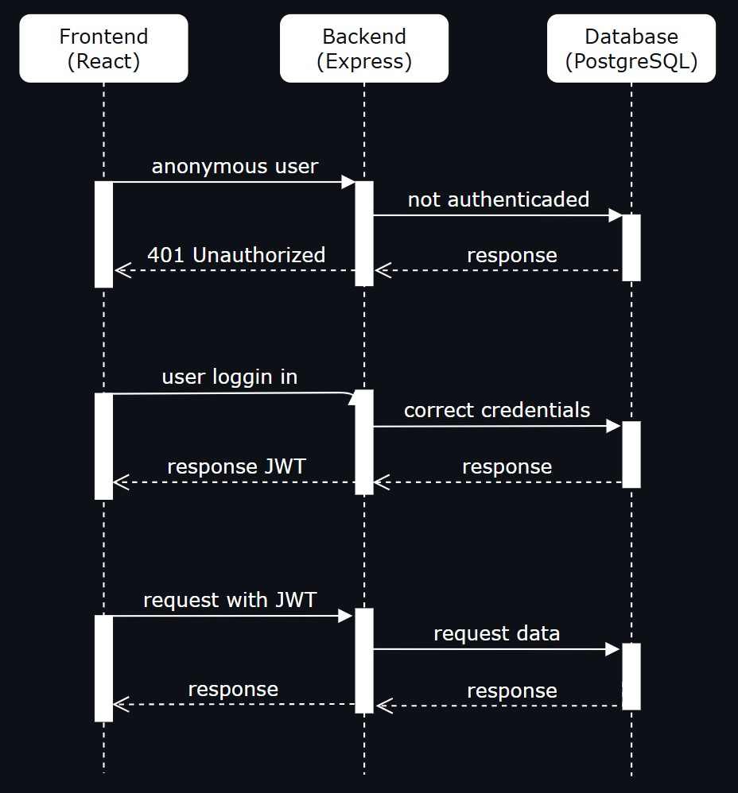
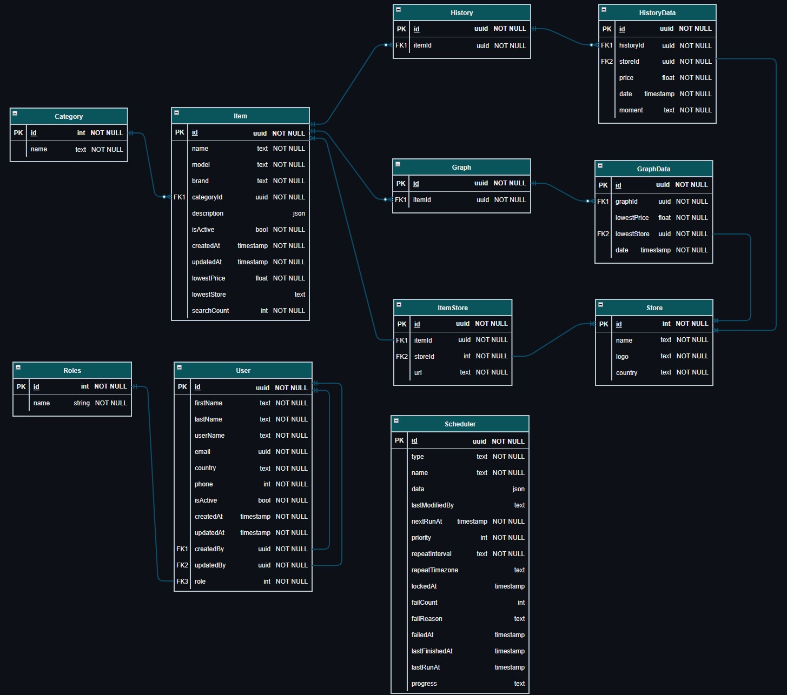

# Find a Deal

### Price monitoring and comparison app

<br>

## Description

Finding the best price for a product online should be a simple task, but it’s made difficult by biased search results influenced by "promoted" retailers, search engine algorithms, and user browsing history. While finding the lowest current price is relatively easy, buyers are often left without access to critical insights, such as price history and trends, that can help them determine whether they're getting a good deal or overpaying.

This project aims to solve these challenges by creating a transparent, intuitive, and user-friendly platform that will empower users to make smarter purchasing decisions by providing price comparisons, historical price data and access to trustworthy retailers.

<br>

## Table of Contents

- [Project Overview](#project-overview)
  - [Technology Stack](#technology-stack)
  - [Features](#features)
  - [User Stories](#user-stories)
- [High Level Design](#high-level-design)
- [Database Schema](#database-schema)
- [API contracts](#api-contracts)
  - [User and Authentication](#user-and-authentication)
    - [Register](#1-register-a-new-user)
    - [Login](#2-login)
    - [Logout](#3-logout)
    - [User Details](#4-user-details)
  - [Items](#items)
    - [Item Details](#1-item-details)
    - [Main Deals](#2-main-deals)
    - [30-day Price History](#3-30-day-item-price-history)
  - [Search](#search)
    - [Quick Search](#1-quick-search)
  - [Stores](#stores)
    - [All Stores](#1-all-stores)
- [Contributing](#contributing)

<br>

## Project Overview

The app will allow users to:

- Search for products by name, model or brand.
- View a product's current lowest price from a set of online stores.
- View a product's historical price trend.
- View a product's specifications as detailed by the manufacturer (Future implementation).
- Navigate between products categories (Future implementation).
- Navigate between daily/weekly deal highlights (Future implementation).
- Select a country (Future Implementation).
- Create/login to an account.
- Save product searches (Future implementation).
- Create and set price alert notifications by email (Future implementation).
- Use it's mobile website version.

<br>

### Technology Stack

- **Frontend:**
  - Typescript + React 19 + React Router v7
  - React Query (TanStack)
  - Axios
  - ShadCN + Lucide
  - Zod
- **Backend:**
  - Typescript + Node + Express v4
  - Agenda
  - MongoDB Atlas + PostgreSQL + Prisma + Mongoose
  - Puppeteer + Bright Data Proxy
  - Zod + Bcrypt + JWT
- **API:**
  - Custom backend + MongoDB Atlas + Bright Data + Cloudinary
- **Version Control:**
  - Git + GitHub
- **Deployment:**
  - Frontend: Vercel
  - Backend: Render
  - Database: Neon (Vercel)
  - Static Images: Cloudinary

<br>

### Features

- **Routing:**
  - **Home Page:**
    - Search bar for item name, model or brand
    - Country selection button
    - Signup/register button
    - Categories menu
    - Ads carousel
    - Retailers carousel
    - Short Deals carousel
  - **Item Page:**
    - Display some images of the product
    - Button to set an alert for the product
    - Display a list with current pricings and links
    - Display a graph with historical lowest values
- **Search Functionality:**
  - Allows user to search by just typing a product name, model or brand
  - Display a list with small images and the item name as a dropdown
  - Display only items that are available in database
- **Price Comparison Graph:**
  - Display a line graph to show historical item prices for the last 30 days
- **Web Scraper Algorithm:**
  - Navigate to a retailer website and find the correct price for an item
  - Save the price and status as an Event on database
- **User Authentication:**
  - Users can register and log in using email and password
  - Role-based access for "not logged in", "logged in" and "premium" users
- **Responsiveness:**
  - Ensure the app is responsive for both desktop and mobile view

<br>

### User Stories

- As a user I would like to use the website without the need of creating an account
- As a user I would like to create an account
- As a user I would like to search for an item and find its price
- As a user I would like to check the price history of an item

<br>

## High Level Design



<br>

## Database Schema



<br>

## API Contracts

### Response

Each API response will follow a specific schema independently of a successful response or not:

```js
{
  "timestamp": String,
  "success": Boolean,
  "message": String,
  "data": Object
}
```

#### Successful response example

```json
{
  "timestamp": "2025-01-27T12:00:00Z",
  "success": true,
  "message": "Request successful",
  "data": {
    "id": "uuid",
    "name": "John Doe",
    "email": "john.doe@example.com",
    "role": "REGULAR_USER"
  }
}
```

#### Error response example

```json
{
  "timestamp": "2025-01-27T12:05:00Z",
  "success": false,
  "message": "User not found",
  "data": null
}
```

<br>

### User and Authentication

#### 1. Register a new user

- **Description:** Register a new user
- **Method:** POST
- **Endpoint:** /api/v1/auth/signup
- **Roles allowed:** SYSTEM, ADMIN
- **Request Body:**

```json
{
  "firstName": "John",
  "lastName": "Doe",
  "email": "john.doe@example.com",
  "phone": "1234567890",
  "password": "AgKcYm13579!"
}
```

- **Response (201 Created):**

```json
{
  "timestamp": "2025-01-27T12:00:00Z",
  "success": true,
  "message": "User registered successfully",
  "data": {
    "id": "1234-4567-9876-5432-1012",
    "firstName": "John",
    "lastName": "Doe",
    "email": "john.doe@example.com",
    "phone": "1234567890",
    "role": "LOGGED_USER"
  }
}
```

A cookie with the JWT will also be sent with the response.

<br>

#### 2. Login

- **Description:** Login into app
- **Method:** POST
- **Endpoint:** /api/v1/auth/signin
- **Roles allowed:** ALL
- **Request Body:**

```json
{
  "email": "john.doe@example.com",
  "password": "AgKcYm13579!"
}
```

- **Response (200 OK):**

```json
{
  "timestamp": "2025-01-27T12:01:00Z",
  "success": true,
  "message": "User logged in successfully",
  "data": {
    "id": "1234-4567-9876-5432-1012",
    "firstName": "John",
    "lastName": "Doe",
    "email": "john.doe@example.com",
    "phone": "1234567890",
    "role": "LOGGED_USER"
  }
}
```

A cookie with the JWT will also be sent with the response.

<br>

#### 3. Logout

- **Description:** Logout from the app
- **Method:** POST
- **Endpoint:** /api/v1/auth/logout
- **Roles allowed:** ALL
- **Response (200 OK):**

```json
{
  "timestamp": "2025-01-27T12:01:00Z",
  "success": true,
  "message": "User logged out successfully",
  "data": {
    "id": "",
    "firstName": "",
    "lastName": "",
    "email": "",
    "phone": "",
    "role": "REGULAR_USER"
  }
}
```

<br>

#### 4. User details

- **Description:** Get user details
- **Method:** GET
- **Endpoint:** /api/v1/users/me
- **Roles allowed:** ALL
- **Response (200 OK):**

Expected two types of responses depending on user authentication:

```json
{
  "timestamp": "2025-01-27T12:03:00Z",
  "success": true,
  "message": "User authenticated",
  "data": {
    "id": "1234-4567-9876-5432-1012",
    "firstName": "John",
    "lastName": "Doe",
    "email": "john.doe@example.com",
    "phone": "1234567890",
    "role": "LOGGED_USER"
  }
}
```

OR

```json
{
  "timestamp": "2025-01-27T12:03:00Z",
  "success": true,
  "message": "User not authenticated",
  "data": {
    "id": "",
    "firstName": "",
    "lastName": "",
    "email": "",
    "phone": "",
    "role": "REGULAR_USER"
  }
}
```

<br>

### Items

#### 1. Item details

- **Description:** Retrieve a specific item and it's details
- **Method:** GET
- **Endpoint:** /api/v1/items/:id
- **Roles allowed:** ALL
- **Response (200 OK):**

```json
{
  "timestamp": "2025-01-27T12:10:00Z",
  "success": true,
  "message": "Item fetched successfully",
  "data": {
    "id": "1",
    "name": "TV 65\" Q60D 4K UHD HDR QLED 2024",
    "model": "QN65Q60DAFXZC",
    "brand": "Samsung",
    "categories": [{ "name": "TV & Home Theatre" }],
    "subCategories": [{ "name": "Televisions" }],
    "subSubCategories": [{ "name": "65 - 69 Inch TVs" }],
    "images": [{ "url": "https://res.cloudinary.com/..." }],
    "description": {},
    "stores": [
      {
        "name": "AMAZON CA",
        "logo": "https://res.cloudinary.com/...",
        "url": "https://www.amazon.ca/..."
      }
    ]
  }
}
```

<br>

#### 2. Main deals

- **Description:** Retrieve 5 items considered as 'deals'
- **Method:** GET
- **Endpoint:** /api/v1/items/current/:itemId
- **Roles allowed:** ALL
- **Response (200 OK):**

```json
{
  "timestamp": "2025-01-27T12:10:00Z",
  "success": true,
  "message": "Item fetched successfully",
  "data": [
    {
      "id": 1,
      "name": "TV 65\" Q60D 4K UHD HDR QLED 2024",
      "model": "QN65Q60DAFXZC",
      "brand": "Samsung",
      "image": {
        "url": "https://res.cloudinary.com/..."
      },
      "price": 1000.0,
      "storesQty": 4
    },
    {...},
  ]
}
```

<br>

#### 3. 30-day item price history

- **Description:** Retrieve price history for an item
- **Method:** GET
- **Endpoint:** /api/v1/items/history/30/:itemId
- **Roles allowed:** ALL
- **Response (200 OK):**

```json
{
  "timestamp": "2025-01-27T12:20:00Z",
  "success": true,
  "message": "Lowest prices fetched successfully",
  "data": [
    {
      "price": 1500.99,
      "date": "2025-01-26T12:00:00Z",
    },
    {
      "price": 1499.99,
      "date": "2025-01-27T12:00:00Z",
    },
    {...}
  ]
}
```

### Search

#### 1. Quick search

- **Description:** Retrieve 5 items that contains the request string
- **Method:** GET
- **Endpoint:** /api/v1/search/quick?q=
- **Roles allowed:** ALL

- **Response (200 OK):**

```json
{
  "timestamp": "2025-01-27T12:15:00Z",
  "success": true,
  "message": "Items fetched successfully",
  "data": [
    {
      "id": 1,
      "name": "TV 65\" Q60D 4K UHD HDR QLED 2024",
      "model": "QN65Q60DAFXZC",
      "brand": "Samsung",
      "image": {
        "url": "https://res.cloudinary.com/..."
      },
      "price": 1000.00
    },
    {...},
  ]
}
```

<br>

### Stores

#### 1. All stores

- **Description:** Retrieve all store details
- **Method:** GET
- **Endpoint:** /api/v1/stores
- **Roles allowed:** ALL

- **Response (200 OK):**

```json
{
  "timestamp": "2025-01-27T12:15:00Z",
  "success": true,
  "message": "Store details fetched successfully",
  "data": [
    {
      "id": 1,
      "name": "AMAZON CA",
      "logo": "https://res.cloudinary.com/..."
    },
    {...},
  ]
}
```

<br>

## Contributing

If you would like to contribute to this project:

1. Fork the Repository and create a branch for your feature or bug fix.

2. Once your changes are ready, push your branch to GitHub and submit a pull request.
