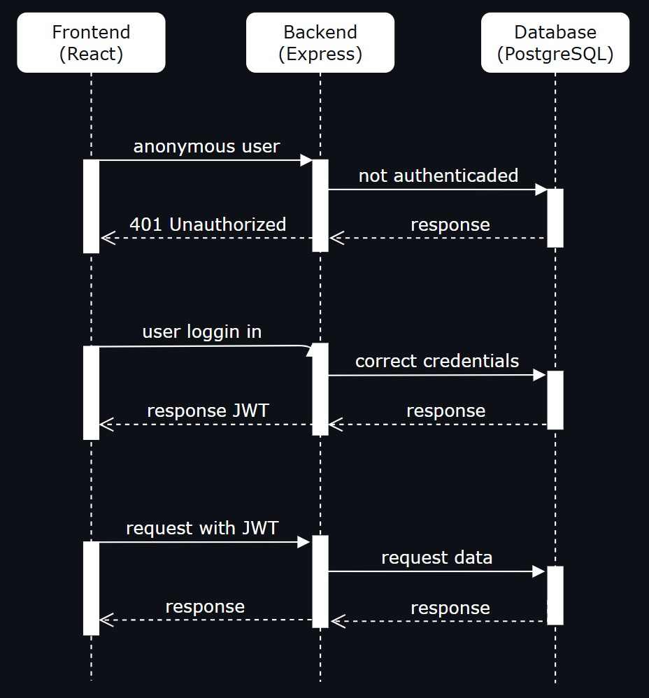
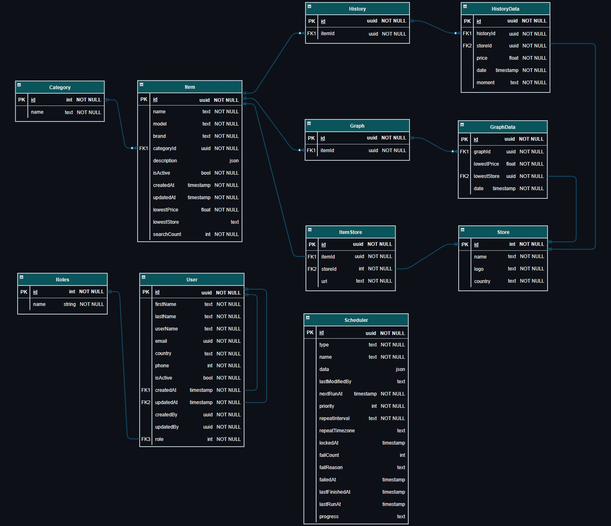

# Find a Deal

### Price monitoring and comparison app

<br>

## Description

Finding the best price for a product online should be a simple task, but it’s made difficult by biased search results influenced by "promoted" retailers, search engine algorithms, and user browsing history. While finding the lowest current price is relatively easy, buyers are often left without access to critical insights, such as price history and trends, that can help them determine whether they're getting a good deal or overpaying.

This project aims to solve these challenges by creating a transparent, intuitive, and user-friendly platform that will empower users to make smarter purchasing decisions by providing comprehensive price comparisons, detailed historical price data, and access to trustworthy retailers, all in one convenient place.

<br>

## Table of Contents

- [Project Overview](#project-overview)
  - [Technology Stack](#technology-stack)
  - [Features](#features)
  - [User Stories](#user-stories)
- [High Level Design](#high-level-design)
- [Database Schema](#database-schema)
- [API contracts](#api-contracts)
  - [User and Authentication](#user-and-authentication)
    - [Register](#1-register-a-new-user)
    - [Login](#2-login)
    - [Logout](#3-logout)
    - [User Details](#4-user-details)
    - [Update User](#5-update-user)
  - [Items and Categories](#items-and-categories)
    - [Item Details](#1-item-details)
    - [All Active Items (Category)](#2-all-active-items-from-category)
    - [Search Item](#3-search-item)
  - [Stores and Pricing](#stores-and-pricing)
    - [Store Details](#1-store-details)
  - [History and Analytics](#history-and-analytics)
    - [Item Price History](#1-item-price-history)
    - [Price-trend 365 days](#2-price-trend-365-days)
    - [Price-trend 180 days](#3-price-trend-180-days)
    - [Price-trend 30 days](#4-price-trend-30-days)
- [Contributing](#contributing)

<br>

## Project Overview

The app will allow users to:

- Search for products by name, model or specifications.
- View a product's current lowest price from a set of trustworthy online stores.
- View a product's historical price trend.
- View a product's specifications as detailed by the manufacturer.
- Navigate between products categories.
- Navigate between daily/weekly deal highlights.
- Create/login to an account.
- Save product searches (Future implementation).
- Create and set price alert notifications by email.
- Use it's mobile website version.

<br>

### Technology Stack

- **Frontend:**
  - Typescript + React.js + React Router
- **Backend:**
  - Typescript + Node + Express
  - Agenda
  - MongoDB Atlas + PostgreSQL + Prisma
  - Puppeteer + Bright Data Proxy
  - Bcrypt + JWT
- **API:**
  - Custom backend + MongoDB Atlas + Bright Data
- **Version Control:**
  - Git + GitHub
- **Deployment:**
  - GitHub Pages
  - Amazon S3 (Images)

<br>

### Features

- **Routing:**
  - **Home Page:**
    - Search form to input item name, model or specifications (Navigation)
    - Login button (Navigation)
    - Categories (Navigation)
    - Retailers Carousel
    - Short Deals
  - **Search Results Page:**
    - Display all related products to the user
  - **Item Page:**
    - Display some images of the product
    - Display a table with current pricings and links
    - Display a graph with historical lowest values
    - Display product specifications
    - Allow users to set an alert for the product
  - **Categories Page:**
    - Display a list of categories that the user can browse
- **Search Functionality:**
  - Allows user to search by just typing a product name, model or specification
  - Display a small image and item name on quick search result
  - Limit to show only what's available
  - Add button for user request a non available item to be added in the future
- **Price Comparison Graph:**
  - Display a line graph to show historical item prices
  - Users can filter the graph by: Month, 6-Month, 12-Month
- **Web Scraper Algorithm:**
  - Navigate to a retailer website and find the correct price for an item
  - Send raw information to the data analysis algorithm
- **Data Analysis Algorithm:**
  - Algorithm that will analyse lowest value from all scraped sources
  - Save analyzed information to DB
- **User Authentication:**
  - Users can register and log in using email and password
  - Role-based access for "not logged in", "logged in" and "premium" users
- **Alerts:**
  - Allows user to set an email alert for a selected price range
- **Email Notifications:**
  - Send emails to notify a user on a created alert
- **Mobile Responsiveness:**
  - Ensure the app is responsive for both desktop and mobile view

<br>

### User Stories

- As a user I would like to use the website without the need of creating an account
- As a user I would like to create an account
- As a user I would like to search for an item and find its price
- As a user I would like to check the price history of an item
- As a user I would like to set an email alert for a price drop of an item
- As a user I would like to save a search to my profile
- As a user I would like to request for a new item to be added to the website search

<br>

## High Level Design



<br>

## Database Schema



<br>

## API Contracts

Each API request will need to follow a specific schema in a JSON format that will be defined below.

The response of all APIs will follow the same schema independently of a successful response or not:

```js
{
  "timestamp": String,
  "success": Boolean,
  "message": String,
  "data": Object
}
```

The currently available roles are:

- SYSTEM
- ADMIN
- REGULAR_USER
- LOGGED_USER
- PREMIUM_USER

The 'SYSTEM' role will have access to all endpoints and will be used for all actions performed directly through the backend or an external DBM system.

### Successful response example

```json
{
  "timestamp": "2025-01-27T12:00:00Z",
  "success": true,
  "message": "Request successful",
  "data": {
    "id": "uuid",
    "name": "John Doe",
    "email": "john.doe@example.com",
    "role": "REGULAR_USER"
  }
}
```

### Error response example

```json
{
  "timestamp": "2025-01-27T12:05:00Z",
  "success": false,
  "message": "User not found",
  "data": null
}
```

<br>

### User and Authentication

#### 1. Register a new user

- **Description:** Register a new user
- **Method:** POST
- **Endpoint:** /api/v1/auth/register
- **Roles allowed:** SYSTEM, ADMIN
- **Request Body:**

```json
{
  "name": "John Doe",
  "email": "john.doe@example.com",
  "password": "SecurePass123!",
  "role": "REGULAR_USER"
}
```

- **Response (201 Created):**

```json
{
  "timestamp": "2025-01-27T12:00:00Z",
  "success": true,
  "message": "User registered successfully",
  "data": {
    "id": "uuid",
    "name": "John Doe",
    "email": "john.doe@example.com",
    "role": "REGULAR_USER",
    "createdAt": "2025-01-27T12:00:00Z"
  }
}
```

<br>

#### 2. Login

- **Description:** Login into app
- **Method:** POST
- **Endpoint:** /api/v1/auth/login
- **Roles allowed:** ALL
- **Request Body:**

```json
{
  "email": "john.doe@example.com",
  "password": "SecurePass123!"
}
```

- **Response (200 OK):**

```json
{
  "timestamp": "2025-01-27T12:01:00Z",
  "success": true,
  "message": "Login successful",
  "data": {
    "token": "jwt-token",
    "expiresIn": 3600
  }
}
```

<br>

#### 3. Logout

- **Description:** Logout from the app
- **Method:** POST
- **Endpoint:** /api/v1/auth/logout
- **Roles allowed:** ALL
- **Response (200 OK):**

```json
{
  "timestamp": "2025-01-27T12:02:00Z",
  "success": true,
  "message": "Logged out successfully",
  "data": null
}
```

<br>

#### 4. User details

- **Description:** Get authenticated user details
- **Method:** GET
- **Endpoint:** /api/v1/auth/me
- **Roles allowed:** ALL
- **Response (200 OK):**

```json
{
  "timestamp": "2025-01-27T12:03:00Z",
  "success": true,
  "message": "User details fetched",
  "data": {
    "id": "uuid",
    "name": "John Doe",
    "email": "john.doe@example.com",
    "role": "REGULAR_USER",
    "createdAt": "2025-01-27T12:00:00Z"
  }
}
```

<br>

#### 5. Update user

- **Description:** Update user details
- **Method:** PATCH
- **Endpoint:** /api/v1/users/{id}
- **Roles allowed:** SYSTEM, ADMINISTRATOR (for any user); REGULAR_USER and PREMIUM_USER (only for themselves)
- **Request Body (Admin Editing Another User):**

```json
{
  "name": "Updated Name",
  "role": "PREMIUM_USER"
}
```

- **Request Body (User Editing Their Own Profile):**

```json
{
  "name": "Updated Name"
}
```

- **Response (200 OK):**

```json
{
  "timestamp": "2025-01-27T12:04:00Z",
  "success": true,
  "message": "User updated successfully",
  "data": {
    "id": "uuid",
    "name": "Updated Name",
    "email": "john.doe@example.com",
    "role": "PREMIUM_USER"
  }
}
```

<br>

### Items and Categories

#### 1. Item details

- **Description:** Retrieve item details
- **Method:** GET
- **Endpoint:** /api/v1/items/{id}
- **Roles allowed:** ALL
- **Response (200 OK):**

```json
{
  "timestamp": "2025-01-27T12:10:00Z",
  "success": true,
  "message": "Item details fetched successfully",
  "data": {
    "id": "uuid",
    "name": "TV",
    "category": "Electronics",
    "description": Object,
    "lowestPrice": 1500.99,
    "lowestStore": "Store 1",
    "createdAt": "2025-01-27T11:00:00Z"
  }
}
```

<br>

#### 2. All active items from category

- **Description:** Retrieves all active items from specified category
- **Method:** GET
- **Endpoint:** /api/v1/categories/{categoryId}/items
- **Roles allowed:** ALL
- **Response (200 OK):**

```json
{
  "timestamp": "2025-01-27T12:11:00Z",
  "success": true,
  "message": "Items fetched successfully",
  "data": [
    {
      "id": "uuid",
      "name": "Gaming Laptop",
      "lowestPrice": 1500.99,
      "lowestStore": "Store 1"
    },
    {
      "id": "uuid",
      "name": "Mechanical Keyboard",
      "lowestPrice": 1500.99,
      "lowestStore": "Store 1"
    }
  ]
}
```

<br>

#### 3. Search item

- **Description:** Search an item by name
- **Method:** GET
- **Endpoint:** /api/v1/items/search?q={query}
- **Roles allowed:** ALL
- **Response (200 OK):**

```json
{
  "timestamp": "2025-01-27T12:12:00Z",
  "success": true,
  "message": "Search results fetched successfully",
  "data": [
    {
      "id": "uuid",
      "name": "Gaming Laptop",
      "lowesrPrice": 1500.99,
      "lowestStore": "Store 1"
    }
  ]
}
```

<br>

### Stores and Pricing

#### 1. Store details

- **Description:** Retrieve store details
- **Method:** GET
- **Endpoint:** /api/v1/stores/{id}
- **Roles allowed:** ALL

- **Response (200 OK):**

```json
{
  "timestamp": "2025-01-27T12:15:00Z",
  "success": true,
  "message": "Store details fetched successfully",
  "data": {
    "id": "uuid",
    "name": "Tech Store",
    "logo": "https://imageurl.com/",
    "country": "contact@techstore.com"
  }
}
```

<br>

### History and Analytics

#### 1. Item price history

- **Description:** Retrieve price history for an item
- **Method:** GET
- **Endpoint:** /api/v1/items/{itemId}/price-history
- **Roles allowed:** SYSTEM, ADMIN (fetch all history), others (fetch last entry only)
- **Response (200 OK for SYSTEM or ADMIN):**

```json
{
  "timestamp": "2025-01-27T12:20:00Z",
  "success": true,
  "message": "Price history fetched successfully",
  "data": [
    {
      "lowesrPrice": 1500.99,
      "lowestStore": "Store 1",
      "date": "2025-01-26T12:00:00Z",
    },
    {
      "lowesrPrice": 1499.99,
      "lowestStore": "Store 2",
      "date": "2025-01-27T12:00:00Z",
    },
    {...}
  ]
}
```

- **Response (200 OK for other roles):**

```json
{
  "timestamp": "2025-01-27T12:00:00Z",
  "success": true,
  "message": "Price history fetched successfully",
  "data": [
    {
      "lowesrPrice": 1500.99,
      "lowestStore": "Store 1",
      "date": "2025-01-26T12:00:00Z"
    }
  ]
}
```

<br>

#### 2. Price-trend 365 days

- **Description:** Retrieve the last 365 days of price trends for an item
- **Method:** GET
- **Endpoint:** /api/v1/items/{itemId}/price-trends/365-days
- **Roles allowed:** ALL but REGULAR_USER
- **Response (200 OK):**

```json
{
  "timestamp": "2025-01-27T12:00:00Z",
  "success": true,
  "message": "Price trends for the last 365 days fetched",
  "data": [
    {
      "lowesrPrice": 1500.99,
      "lowestStore": "Store 1",
      "date": "2025-01-26T12:00:00Z"
    },
    {...}
  ]
}
```

<br>

#### 3. Price-trend 180 days

- **Description:** Retrieve the last 180 days of price trends for an item
- **Method:** GET
- **Endpoint:** /api/v1/items/{itemId}/price-trends/180-days
- **Roles allowed:** ALL but REGULAR_USER
- **Response (200 OK):**

```json
{
  "timestamp": "2025-01-27T12:00:00Z",
  "success": true,
  "message": "Price trends for the last 180 days fetched",
  "data": [
    {
      "lowesrPrice": 1500.99,
      "lowestStore": "Store 1",
      "date": "2025-01-26T12:00:00Z"
    },
    {...}
  ]
}
```

<br>

#### 4. Price-trend 30 days

- **Description:** Retrieve the last 30 days of price trends for an item
- **Method:** GET
- **Endpoint:** /api/v1/items/{itemId}/price-trends/30-days
- **Roles allowed:** ALL
- **Response (200 OK):**

```json
{
  "timestamp": "2025-01-27T12:00:00Z",
  "success": true,
  "message": "Price trends for the last 30 days fetched",
  "data": [
    {
      "lowesrPrice": 1500.99,
      "lowestStore": "Store 1",
      "date": "2025-01-26T12:00:00Z"
    },
    {...}
  ]
}
```

<br>

## Contributing

If you would like to contribute to this project:

1. Fork the Repository and create a branch for your feature or bug fix.

2. Once your changes are ready, push your branch to GitHub and submit a pull request.
